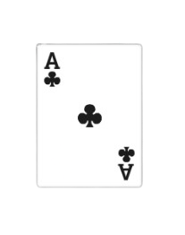

# Arena




Arena is a collection of Brazilian card games developed in C99 using the Raylib library, currently in its very early development phase. The first alpha release will feature the popular game Fodinha, with plans to expand further. The current codebase is a bit messy, and it will undergo significant refactoring to improve structure and readability.

## Development status

Alpha release planned for March 2025.

Features:

| Feature                  | Status                            | Description |
|:-------------------------|:----------------------------------|:------------|
| Refactor current code    | :black_square_button: In progress | Improve everything |
| Pop-up windows           | :white_square_button: Planned     | For configuration, volume control, etc | 
| ...                      | ...                               | ... |
| Networking               | :white_square_button: Planned     | I have not decided the protocol yet |
| Patching                 | :white_square_button: Planned     | Automatic updates |
| ...                      | ...                               | ... |

## Instructions

The build script should handle everything by himself:

```bash
$ ./build.sh
```

## Security

If you discover a security vulnerability within Arena, please check out our [Security Policy](SECURITY.md) for more details. All security vulnerabilities will be promptly addressed.

## License

This project is licensed under the [MIT License](https://opensource.org/licenses/MIT). Feel free to use, modify, and distribute the code as needed. See the [LICENSE](LICENSE) file for more information.
